# AWS Demo S3 Bucket ROIVATION demo

Terraform configuration for AWS infrastructure imported into ops0 from a cloud resource scan, hardened against the Checkov S3 controls.

## What this provisions

This project manages the S3 bucket `roi-vation-ops0-s3` (imported from AWS) together with the supporting resources required to satisfy the standard Checkov S3 baseline: a customer-managed KMS key for encryption, a public access block, a dedicated server-access log bucket, a lifecycle policy on noncurrent versions, an SNS topic that receives `ObjectCreated` / `ObjectRemoved` notifications, and a cross-region replication destination bucket with an IAM role.

## Architecture

```mermaid
architecture-beta
group aws(logos:aws)["AWS account primary region"]
group storage(logos:aws-s3)["Storage tier"] in aws
group security(logos:aws)["Security and eventing"] in aws
group replica_acc(logos:aws)["AWS account replica region"]

service bucket(logos:aws-s3)["roi-vation-ops0-s3"] in storage
service logs(logos:aws-s3)["Access log bucket"] in storage
service kms(logos:aws)["KMS CMK"] in security
service sns(logos:aws)["SNS S3 events"] in security
service pab(logos:aws)["Public access block"] in security
service replica(logos:aws-s3)["Replica bucket"] in replica_acc

bucket:R --> L:logs
bucket:B --> T:kms
bucket:T --> B:pab
bucket:R --> L:sns
bucket:R --> L:replica
```

## Modules

- `provider.tf` — AWS provider pinned to `~> 5.0` and the project's `required_version` / `required_providers` (single source of truth); primary region from `var.aws_region`, `aws.replica` alias from `var.replica_region`.
- `backend.tf` — S3 remote backend (`bucket = roi-vation-ops0-s3`, `key = discovery/terraform.tfstate`, encrypted). No state locking is configured yet — see Troubleshooting.
- `terraform.tf` — intentionally empty placeholder kept so the file isn't deleted from the repo. All `terraform { ... }` settings live in `provider.tf` and `backend.tf`.
- `main.tf` — primary bucket, KMS key, public access blocks, logging, lifecycle, SNS notifications, replica bucket, IAM replication role, and replication configuration.
- `imports.tf` — Terraform 1.5+ `import` blocks that bind the existing AWS bucket to Terraform resource addresses.
- `variables.tf` — inputs for regions, ops0 tracking, and standard tagging.
- `outputs.tf` — exposes bucket IDs, ARNs, the KMS key ARN, and the SNS topic ARN.

## Inputs

| Name            | Type   | Description                                                  | Default                                  | Required? |
|-----------------|--------|--------------------------------------------------------------|------------------------------------------|-----------|
| aws_region      | string | AWS region where the imported resources exist                | `us-east-1`                              | No        |
| replica_region  | string | AWS region used as the cross-region replication destination  | `us-west-2`                              | No        |
| conversation_id | string | ops0 conversation ID used for resource tracking and isolation | —                                        | Yes       |
| environment     | string | Deployment environment (dev, staging, production)            | `production`                             | No        |
| project_name    | string | Project name used for resource tagging                       | `aws-demo-s3-bucket-roivation-demo`      | No        |
| owner           | string | Team or individual responsible for these resources           | `platform-team`                          | No        |
| cost_center     | string | Cost center code for billing allocation                      | `""`                                     | No        |

## Outputs

| Name                            | Description                                            | Sensitive? |
|---------------------------------|--------------------------------------------------------|------------|
| s3_bucket_ids                   | Map of imported S3 bucket IDs                          | No         |
| s3_bucket_arns                  | Map of imported S3 bucket ARNs                         | No         |
| s3_bucket_domain_names          | Map of imported bucket domain names                    | No         |
| s3_bucket_regional_domain_names | Map of imported regional domain names                  | No         |
| s3_logs_bucket_id               | ID of the dedicated S3 server-access log bucket        | No         |
| s3_replica_bucket_arn           | ARN of the cross-region replication destination bucket | No         |
| s3_kms_key_arn                  | ARN of the customer-managed KMS key for S3 encryption  | No         |
| s3_events_topic_arn             | ARN of the SNS topic receiving S3 event notifications  | No         |

## Recommended items

- **CKV2_AWS_6 — Public access block** (CRITICAL) — `aws_s3_bucket_public_access_block.this` blocks ACLs and policies that would expose the bucket publicly. Adopted.
- **CKV_AWS_18 — Access logging** (HIGH) — server access logs are written to `aws_s3_bucket.logs` under `s3-access-logs/<key>/`. Adopted.
- **CKV_AWS_145 — KMS encryption** — SSE switched from AES256 to `aws:kms` using `aws_kms_key.s3` with bucket keys enabled. Adopted.
- **CKV2_AWS_61 — Lifecycle configuration** — noncurrent versions transition to STANDARD_IA at 30d, GLACIER at 90d, and expire at 365d; incomplete multipart uploads abort after 7d. Adopted.
- **CKV2_AWS_62 — Event notifications** — `ObjectCreated:*` and `ObjectRemoved:*` events publish to `aws_sns_topic.s3_events` (KMS-encrypted) with an S3-scoped topic policy. Adopted.
- **CKV_AWS_144 — Cross-region replication** — replication to `aws_s3_bucket.replica` in `var.replica_region` via a dedicated IAM role. Adopted.

## Status summary

- **Compliance** → No policies attached yet. See [EVIDENCE.md](./EVIDENCE.md).
- **Vulnerabilities** → 8 findings (0 CRITICAL, 0 HIGH, 1 MEDIUM, 7 LOW) on the last scan. See [VULNERABILITIES.md](./VULNERABILITIES.md).
- **Cost** → $1.00/mo estimated from current files (KMS key is the only billed line item today). See [FINOPS.md](./FINOPS.md).
- **Drift** → No drift check yet. See [DRIFT.md](./DRIFT.md).

## Deploy

This project is managed via the ops0 platform:

1. Push the generated files to the connected GitHub repository using the **Push** button.
2. Click the **Deploy** button. ops0 runs `terraform plan` first. On this run the plan will show the imported bucket changing encryption from AES256 to `aws:kms` and acquiring a public access block, logging, lifecycle, notifications, and replication — plus new KMS/SNS/IAM/replica/log resources being created.
3. Optionally use **Targeted Deploy** to roll the security hardening out resource-by-resource.

## Operate

- State is managed remotely by ops0 — do not run `terraform apply` locally.
- After the first successful deploy, you can remove `imports.tf` on the next change.
- The replica region defaults to `us-west-2`; override `replica_region` in `terraform.tfvars` if you need a different destination.
- The KMS key has a 30-day deletion window and rotation enabled — do not detach it from the bucket without first re-encrypting existing objects.

## Troubleshooting

- **`Error: Unsupported argument` on `backend.tf` for `use_lockfile`** — native S3 state locking via `use_lockfile = true` requires Terraform `>= 1.10`. This project pins `required_version = ">= 1.5.0"` (which resolves to 1.5.x in the ops0 runner), so the argument is rejected at `terraform init`. Either bump `required_version` to `>= 1.10` and re-add `use_lockfile = true`, or add `dynamodb_table = "<lock-table>"` in `backend.tf` (the classic locking mechanism that works on 1.5+).
- **`Error: Duplicate required providers configuration`** — Terraform allows only one `required_providers` block per module. `provider.tf` is the canonical home; `terraform.tf` is kept as an empty placeholder. If you add provider requirements, edit `provider.tf` — do NOT redeclare them in `terraform.tf` or `backend.tf`.
- **`PutBucketReplication` fails with `Destination bucket must have versioning enabled`** — `aws_s3_bucket_replication_configuration.this` must depend on BOTH `aws_s3_bucket_versioning.this` (source) AND `aws_s3_bucket_versioning.replica` (destination). Without the replica dependency Terraform can race the replication call ahead of versioning on the destination bucket and AWS rejects with `InvalidRequest`. Both are now listed in the resource's `depends_on`.
- **Plan shows encryption change on the imported bucket** — expected: SSE is being upgraded from AES256 to KMS to address CKV_AWS_145.
- **`aws_s3_bucket_notification` fails with `Unable to validate the following destination configurations`** — the SNS topic policy must be in place first; the `depends_on` on `aws_sns_topic_policy.s3_events` handles this, but a fresh deploy can race with eventual consistency — re-run apply.
- **Replication shows `Failed`** — check that the source bucket has versioning enabled (it does) and that the replication IAM role has `kms:Decrypt` on the source KMS key (granted via `aws_iam_role_policy.replication`).
- **Cost increase** — KMS requests, the replica bucket's storage and cross-region transfer, and the access log bucket all add cost; the next Infracost run will quantify it in `FINOPS.md`.
