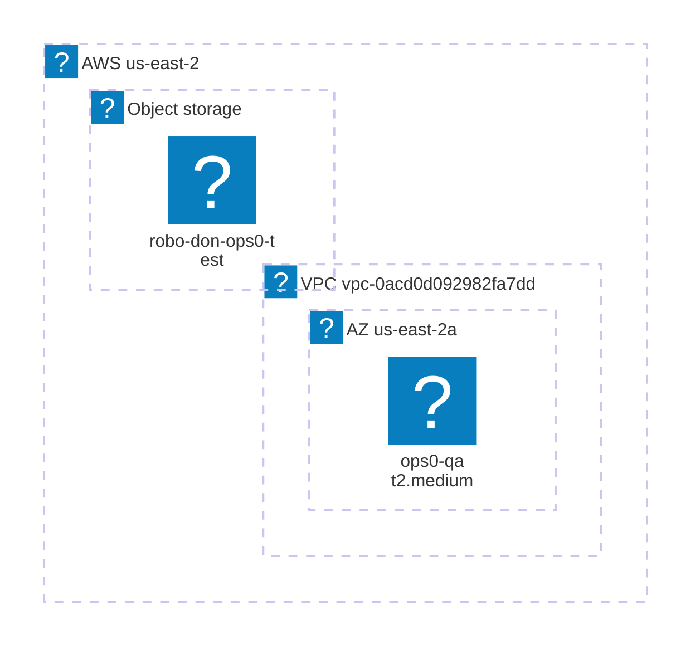

# ops0-dev

Terraform project that adopts existing AWS infrastructure into managed state via Terraform 1.5+ import blocks, plus net-new AWS resources managed alongside them.

## What this provisions

Imports one pre-existing EC2 instance in `us-east-2` and provisions a new S3 bucket (`robo-don-ops0-test`) with versioning, AES256 encryption, and full public-access block.

## Architecture

```mermaid
architecture-beta
group aws(logos:aws)["AWS us-east-2"]
group vpc(logos:aws)["VPC vpc-0acd0d092982fa7dd"] in aws
group az(logos:aws)["AZ us-east-2a"] in vpc
group storage(logos:aws-s3)["Object storage"] in aws

service ec2(logos:aws-ec2)["ops0-qa t2.medium"] in az
service bucket(logos:aws-s3)["robo-don-ops0-test"] in storage
```
## Modules

- `provider.tf` — AWS provider pinned to `~> 5.0`, region driven by `var.region`.
- `variables.tf` — Input variables including the `ec2_instances` map that keys imported instances by logical name.
- `main.tf` — `aws_instance.this` keyed by `for_each` so future EC2 imports slot in without restructuring.
- `s3.tf` — `aws_s3_bucket.robo_don_ops0_test` plus versioning, encryption, and public-access-block sidecars.
- `imports.tf` — Terraform 1.5+ `import` blocks that adopt existing AWS resources into state.
- `outputs.tf` — IDs, ARNs, and IPs of managed resources.

## Inputs

| Name | Type | Description | Default | Required? |
|---|---|---|---|---|
| `region` | `string` | AWS region where the imported resources live | `us-east-2` | No |
| `conversation_id` | `string` | ops0 conversation ID (surfaced as an output for traceability) | — | Yes |
| `ec2_instances` | `map(object({ instance_id, instance_type, ami, availability_zone, subnet_id, tags }))` | EC2 instances to manage, keyed by logical name. `ami` is required by the AWS provider but ignored via `lifecycle.ignore_changes` so imports are non-destructive. | 1 entry (`ops0_qa`) | No |

## Outputs

| Name | Description | Sensitive? |
|---|---|---|
| `conversation_id` | ops0 conversation ID this project is tied to | No |
| `instance_ids` | Map of logical name to EC2 instance ID | No |
| `instance_arns` | Map of logical name to EC2 instance ARN | No |
| `instance_private_ips` | Map of logical name to private IP | No |
| `instance_public_ips` | Map of logical name to public IP | No |
| `robo_don_ops0_test_bucket_id` | ID (name) of the new S3 bucket | No |
| `robo_don_ops0_test_bucket_arn` | ARN of the new S3 bucket | No |

## Recommended items

- No ops0 recommendations applied yet — will surface after the first deployment / scan.

## Status summary

- **Compliance** → No policies attached yet. See [EVIDENCE.md](./EVIDENCE.md).
- **Vulnerabilities** → No scan yet. See [VULNERABILITIES.md](./VULNERABILITIES.md).
- **Cost** → No estimate yet. See [FINOPS.md](./FINOPS.md).
- **Drift** → No drift check yet. See [DRIFT.md](./DRIFT.md).

## Deploy

In ops0: push these files to the connected GitHub repo, then click **Deploy**. The `import` blocks run during `terraform apply` and bring existing AWS resources under management without recreating them.

## Operate

- The `aws_instance.this` resource uses `lifecycle.ignore_changes` for AMI, user_data, block devices, and network interfaces so the initial import does not force replacement. Tighten this once the imported state has been reconciled.
- Add new EC2 instances by extending the `ec2_instances` map in `terraform.tfvars` and adding a matching `import` block in `imports.tf`. Each entry now requires an `ami` value — it can be any valid AMI ID since `ami` is in `ignore_changes` and the real value is read from AWS during import.
- S3 bucket names are globally unique — if `robo-don-ops0-test` is already taken, apply will fail on create; choose a different name.

## Troubleshooting

- **`"ami": one of ami,launch_template must be specified`** — the `aws_instance` resource requires an `ami` value even when the resource is being imported. The `ec2_instances` map carries an `ami` field for this; set it to any valid AMI ID (it will be ignored via `lifecycle.ignore_changes`).
- **Import fails with tag mismatch** — the resource in AWS has tags not reflected here. Update `ec2_instances[<key>].tags` to match exactly, then re-run.
- **Plan shows replacement after import** — an attribute the config doesn't set differs from AWS. Add the attribute to `ignore_changes` or set it explicitly in `main.tf`.
- **`BucketAlreadyExists` on S3** — the name `robo-don-ops0-test` is claimed globally by another account. Rename the bucket.
